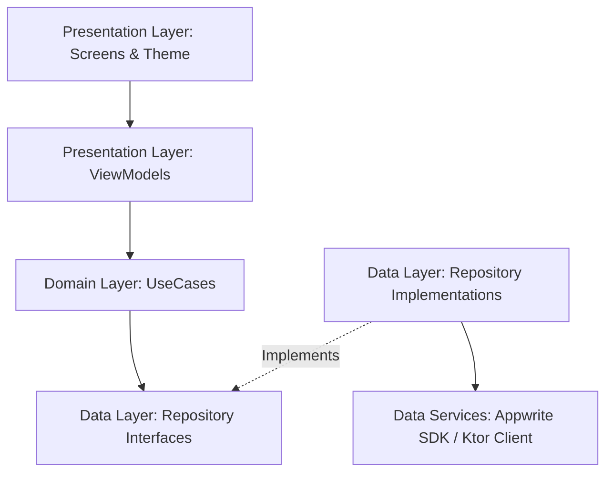

# Shopnobilash - Application Architecture & Packages Documentation

This document describes the architectural design and the third-party dependencies/plugins utilized in the Shopnobilash mobile application.

---

## 🏛️ Architecture Design: Clean MVVM

The application follows the **Clean Architecture MVVM (Model-View-ViewModel)** design pattern. It enforces strict separation of concerns, scalability, and testability by structuring the codebase into three main layers:



### 1. Data Layer (`com.shopnobilash.app.data`)
Responsible for data operations, caching, and mapping external data models (e.g., Appwrite Database documents, Ktor API responses) to local Kotlin objects.
- **Feature-Specific Slices**: Data access logic is encapsulated inside feature packages:
  - `data/auth/` — Repository definitions and implementations wrapping the Appwrite Account authentication engine.
  - `data/profile/` — Data classes, drop-down models, and database document CRUD implementations for user profiles.
  - `data/property/` — Property structures, pricing utilities, and mock listings repository.
  - `data/chat/` — Models and mock data representing user threads and chat messages.
  - `data/notification/` — Models representing unread triggers and category items.

### 2. Domain Layer (`com.shopnobilash.app.domain`)
Contains the core business rules and use cases.
- **Pure Kotlin**: This layer is written in pure Kotlin and contains **no Android frameworks, UI widgets, or backend SDK dependencies** (e.g., no Appwrite SDK or Ktor imports).
- **Stateless UseCases**: Individual classes that execute a single operation (e.g., `LoginUseCase`, `GetProfileUseCase`, `ToggleSavePropertyUseCase`). ViewModels interact exclusively with these UseCases, ensuring the business logic remains fully testable in standard JVM environments.

### 3. Presentation Layer (`com.shopnobilash.app.presentation`)
Responsible for rendering state onto the screen and translating user actions into business events.
- **ViewModels**: Manage Compose UI state using Kotlin Coroutines `StateFlow` and handle lifecycle-aware scope executions (`viewModelScope`). ViewModels are decoupled from direct SDKs or platform components.
- **Jetpack Compose UI**: Declarative layouts organized by feature slice (e.g., `home/ui/`, `auth/ui/`).
- **Design Tokens**: Centralized custom styling systems (Color, Shape, Typography, Theme) stored in `presentation/theme/`. Reusable elements like text fields, icons, and buttons reside in `presentation/components/`.

---

## 📂 Package Directory Layout

Below is the directory structure under `app/src/main/java/com/shopnobilash/app/`:

```
com.shopnobilash.app/
├── MainActivity.kt               # Main Host Activity
├── ShopnobilashApp.kt            # Application Class & Koin entry point
├── constants/                    # Application and Appwrite Configuration
├── navigation/                   # Screen definition, routes, AppNavHost graph
├── data/
│   ├── auth/                     # AuthRepository, AuthRepositoryImpl
│   ├── chat/                     # Conversation, ChatMessage
│   ├── notification/             # NotificationItem, NotificationGroup
│   ├── profile/                  # Profile model, ProfileRepository, ProfileRepositoryImpl
│   └── property/                 # Property model, PropertyRepository, PropertyRepositoryImpl
├── domain/
│   ├── auth/usecase/             # CheckSession, SignUp, Login, Logout, Otp UseCases
│   ├── profile/usecase/          # GetProfile, CreateProfile UseCases
│   └── property/usecase/         # GetListings, GetPropertyById, ToggleSave UseCases
└── presentation/
    ├── auth/                     # AuthViewModel, LoginScreen, RegisterScreen, VerifyEmailScreen
    ├── chat/                     # ChatViewModel, ChatListScreen, ChatThreadScreen
    ├── checkout/                 # CheckoutViewModel, CheckoutScreen
    ├── detail/                   # DetailViewModel, DetailScreen
    ├── home/                     # HomeViewModel, HomeScreen
    ├── listing/                  # ListingViewModel, NewlyAddedScreen
    ├── notifications/            # NotificationsViewModel, NotificationsScreen
    ├── onboarding/               # SplashScreen (loading & carousel)
    ├── profile/                  # ProfileViewModel, ProfileScreen
    ├── profile_setup/            # ProfileSetupViewModel, ProfileSetupScreen
    ├── wishlist/                 # WishlistViewModel, WishlistScreen
    ├── components/               # AppButton, AppTextField, BottomNavBar, PropertyCards
    └── theme/                    # Color, Shape, Theme, Type definitions
```

---

## 📦 Core Libraries & Plugins Usage

The application leverages the following libraries and Gradle plugins configured inside `gradle/libs.versions.toml`:

### 1. Jetpack Compose UI Stack
- **`androidx-compose-bom` (2024.09.00)**: Coordinates Compose module releases for compatibility.
- **`androidx-material3`**: Implements the Material Design 3 design system, supporting dynamic styling, dialogs, sheet surfaces, and custom buttons.
- **`navigation-compose` (2.8.0)**: Provides type-safe programmatic transitions and route mapping using standard graph builders (`NavHost`, `composable`).
- **`lifecycle-viewmodel-compose` & `lifecycle-runtime-compose` (2.8.5)**: Hooks ViewModels into the Compose lifecycle and collects StateFlows safely using `collectAsStateWithLifecycle()`.

### 2. Dependency Injection (DI)
- **`koin-android` & `koin-compose` (3.5.6)**: 
  A lightweight Kotlin-native DI framework. Used to resolve and inject:
  - Global clients (Appwrite Client, Databases, Ktor HttpClient).
  - Repository singletons (`AuthRepository`, `PropertyRepository`, `ProfileRepository`).
  - UseCase factory classes (instantiated on demand).
  - ViewModels in Composable screens using `koinViewModel()`.

### 3. Backend-as-a-Service (BaaS)
- **`appwrite` SDK for Android (25.1.0)**: 
  Core cloud platform client. Utilized for:
  - **Account Services**: Creates accounts (`account.create`), manages sessions, processes Email OTP tokens, and executes Google/Facebook OAuth2 authentication flows.
  - **Databases Services**: Queries, writes, and reads profile JSON objects matching users' authenticated IDs.

### 4. Networking & Serialization
- **`ktor-client-android` (2.3.12)**: 
  An asynchronous HTTP client engine. Handles standard REST operations with support for background coroutines.
- **`ktor-client-content-negotiation` & `ktor-serialization-json`**: 
  Installs serializing layers to automatically convert network payloads to Kotlin data classes.
- **`kotlinx-serialization-json` (1.7.1)**: 
  Kotlin compiler plugin providing metadata generation for JSON parsing. Used to serialize map-like databases query arguments.

### 5. Utilities & Assets Loading
- **`coil-compose` (2.7.0)**: 
  Kotlin-first image loading library. Downloads and displays external property thumbnails, placeholders, and user profiles asynchronously with caching support.
- **`ui-text-google-fonts` (1.7.0)**: 
  Dynamically downloads custom typefaces (e.g., Google Fonts Outfit/Inter) at runtime to establish a modern aesthetic without inflating APK size.
